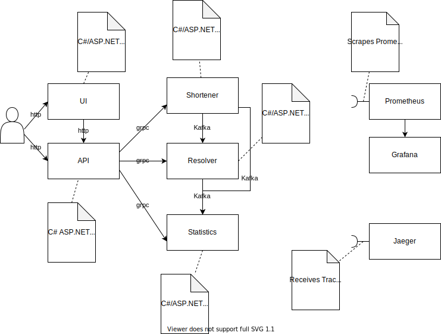

# Url Shortener

## Requirements

Entwickle einen Internetdienst zu Kürzung von URLs wie bit.ly, TinyURL oder Google url shortener.

Anwender können auf einer Seite eine URL angeben und bekommen dafür eine gekürzte Version zurück. Die gekürzte Version einer URL lautet bei jeder Kürzungsanfrage gleich.

Wenn diese gekürzte URL als Adresse in einem Browser benutzt wird, wird nach Umleitung über den Internetdienst das Dokument der ungekürzten URL angezeigt.

Zu jeder gekürzten URL wird eine Statistik geführt:

- Wie oft wurde eine Kürzung der URL gewünscht?
- Wie oft wurde die gekürzte URL aufgerufen?
- Die Statistik kann jeder einsehen. Sie soll auch automatisch nach jeder Kürzung angezeigt werden.

Variation #1
Anwender können sich anmelden. Dann liefern Kürzungen je Anwender eine eigene URL. Zusätzlich zu den bisherigen Statistiken werden dann noch die Aufrufe je Anwender gezählt.

Nur Anwender können Statistiken einsehen. Das soll einen Anreiz sein, sich anzumelden.

## Architecture

The following diagram shows the decomposition of the Url Shortener Software Solution. The architecture is implemented as microservice architecture.

Implementation details

- UI, API, Shortener, Resolver and Statistics are to be created as standalone service
- All services should be in one Visual Studio solution and the whole system is startable with Docker Compose
- There are no references allowed between the services
- Shortener
  - Accepts the long URL and returns the short url
  - Stores: Long Url (hash), Short Url, User (or anonymous), creation timestamp
  - Sends event after creation to Kafka
- Resolver
  - Accepts a short url and returns the long url (key-value lookup, short url as hash)
  - Sends event after resolving
- Statistics
  - Holds statistical information (total and over time)
- UI
  - The access point for the users
  - Should be as fast as possible (make e.g. use of middlewares)
- API
  - The API gateway abstracts away the microservice backend from the UI and the users
